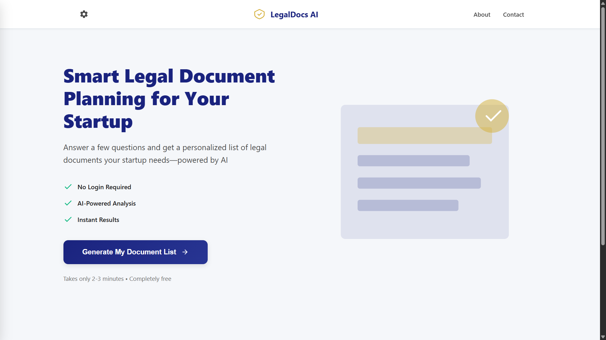
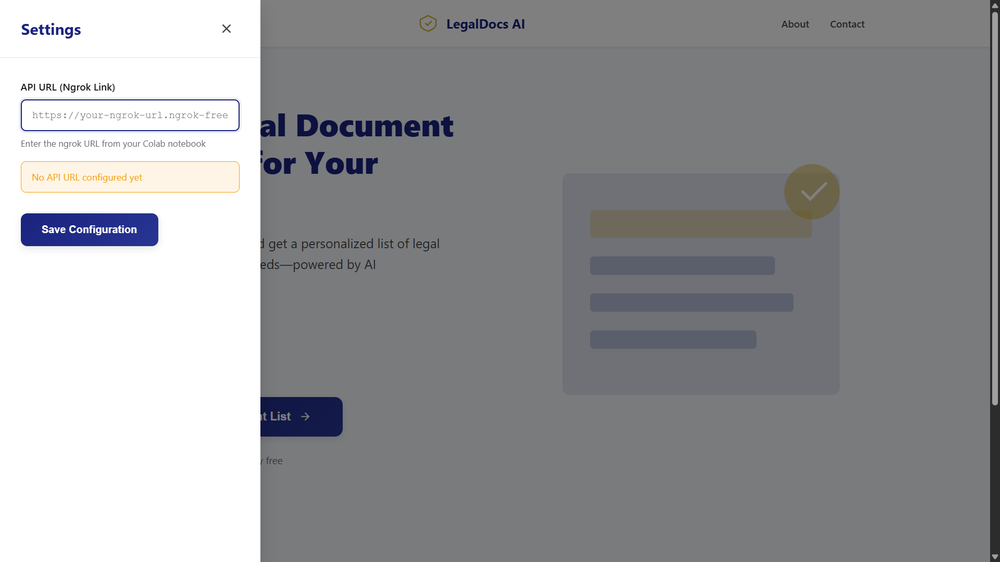
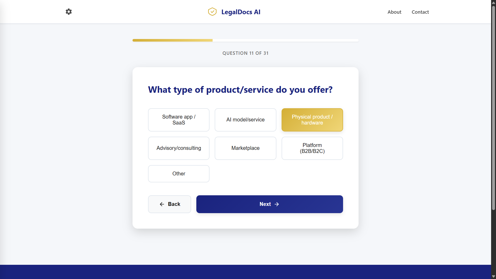
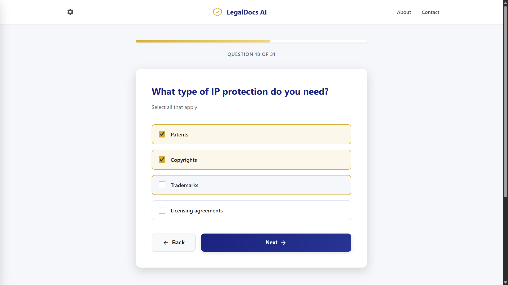
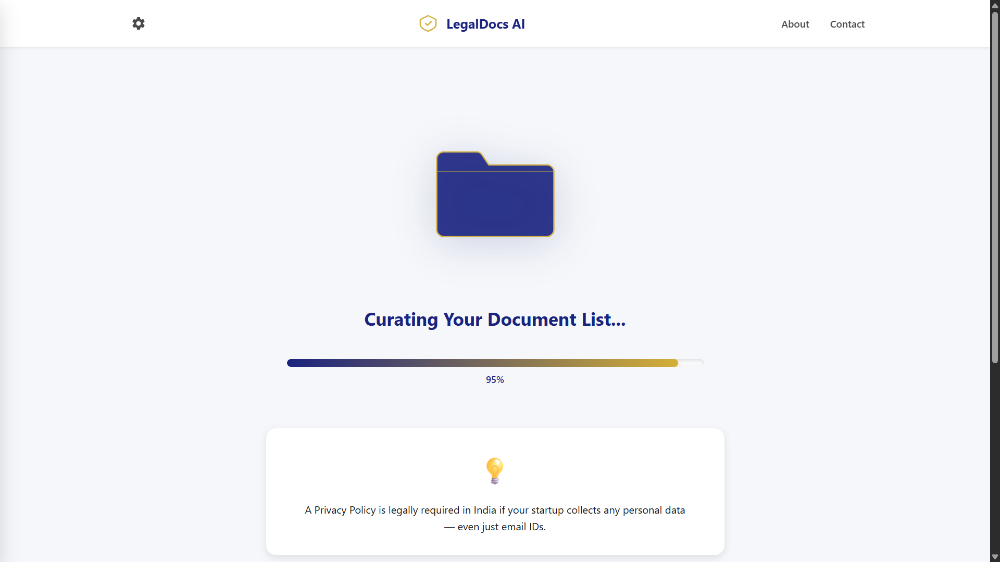
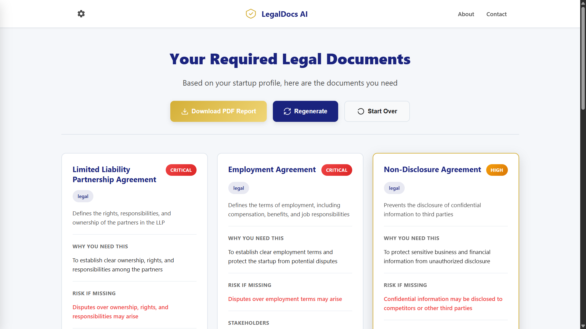

# 🤖 Mistral Legal Advisor - Colab + Local Frontend

A Flask-based frontend server that connects to a fine-tuned Mistral Legal Advisor model running on Google Colab. The model runs on Colab's GPU and generates comprehensive legal document lists for startups, while your local Flask server provides a beautiful web interface.

## 🏗️ Architecture

```
┌─────────────────┐         ┌──────────────────┐         ┌─────────────────┐
│   Web Browser   │ ◄─────► │  Flask Server    │ ◄─────► │  Colab Model    │
│  (Your Local)   │         │  (Your Local)    │         │  (Cloud GPU)    │
└─────────────────┘         └──────────────────┘         └─────────────────┘
     index.html              app.py proxies                Mistral Model
     app.js                  requests to Colab             on GPU
     style.css
```

## 📁 Project Structure

```
Legal-Advisor/
├── app.py                              # Flask server (proxies to Colab)
├── colab_mistral_model_server.ipynb    # Run this on Google Colab
├── requirements.txt                    # Python dependencies
├── README.md                           # This file
├── Screenshots/                        # Application screenshots
└── static/
    ├── index.html                      # Frontend UI
    ├── app.js                          # Frontend logic
    └── style.css                       # Styling
```

## 🚀 Setup Instructions

### Step 1: Setup Colab Model Server

1. **Open the Colab Notebook**
   - Upload or open `colab_mistral_model_server.ipynb` in Google Colab

2. **Get Your Tokens**
   - **Hugging Face Token**: Visit https://huggingface.co/settings/tokens and create a new token
   - **ngrok Token**: Visit https://dashboard.ngrok.com/get-started/your-authtoken and copy your authtoken

3. **Add Tokens in Colab**
   - In the Colab notebook, locate the cell where tokens are required
   - Add your **Hugging Face token** when prompted or in the designated cell
   - Add your **ngrok authtoken** in the ngrok configuration cell
   - These tokens are needed for authentication and creating the public tunnel

4. **Run All Cells in the Notebook**
   - Install dependencies
   - Login to Hugging Face
   - Configure ngrok
   - Load the Mistral model (this may take a few minutes)
   - Start the Flask API server

5. **Copy the ngrok URL**
   - After running all cells, you'll see an ngrok URL (looks like: `https://xxxx-xx-xx-xx-xx.ngrok-free.app`)
   - **Copy this URL** - you'll need it for the frontend

### Step 2: Setup Local Frontend

1. **Install Python Dependencies**
   ```bash
   pip install -r requirements.txt
   ```

2. **Run the Flask Server**
   ```bash
   python app.py
   ```

3. **Open Your Browser**
   - Navigate to: `http://localhost:7860`

4. **Configure the Frontend**
   - In the web interface, click on the settings icon
   - Paste the ngrok URL from Step 1 into the "Colab API URL" field
   - Start generating text!  

<br>
<br>

---

## 📸 Screenshots

### Frontend Landing Page
This is the home page and main landing page of the application.



### Settings - API URL Configuration
Paste the ngrok URL from the Colab notebook here to connect the frontend to the model server.



### Questions Interface
Question interface for multiple-choice options.



Interface for multi-select options.



### Loading Screen
Frontend display shown while the model is generating the response.



### Generated Response
Example of the model generating a comprehensive legal document list based on the questionnaire responses. This includes an option to export the result as a PDF.

  

<br>
<br>

---

## 🎯 How It Works

1. **User enters a prompt** in the web interface
2. **Frontend** (app.js) sends a POST request to local Flask server with the Colab API URL
3. **Flask server** (app.py) proxies the request to Colab via ngrok URL
4. **Colab** processes the prompt using the Mistral model on GPU
5. **Response flows back**: Colab → Flask → Browser
6. **Generated text** is displayed in the UI

## 🔌 API Endpoints

### Local Flask Server (http://localhost:7860)

#### `GET /`
Serves the frontend web interface

#### `GET /api/health`
Check if the server is running

**Response:**
```json
{
  "status": "ok",
  "message": "Frontend server is running"
}
```

#### `POST /api/generate`
Generate text using the model (proxies to Colab)

**Request:**
```json
{
  "prompt": "Generate legal documents for a tech startup...",
  "max_new_tokens": 2048,
  "temperature": 0.5,
  "top_p": 0.9,
  "colab_api_url": "https://xxxx-xx-xx-xx-xx.ngrok-free.app"
}
```

**Response:**
```json
{
  "generated_text": "{\"required_documents\": [...], \"descriptions\": [...]}"
}
```

### Colab API Server (via ngrok)

The Colab notebook runs a Flask server that exposes:

#### `POST /generate`
Direct model inference endpoint

## ⚙️ Configuration

### Model Parameters

Adjust these in the web interface:

- **Max Tokens**: 512-2048 (length of generated document list, default: 2048)
- **Temperature**: 0.1-1.0 (response consistency, default: 0.5)
- **Top P**: 0.1-1.0 (nucleus sampling, default: 0.9)

## 🛠️ Troubleshooting

### "Cannot connect to Colab API"
- ✅ Check if Colab notebook is running
- ✅ Verify ngrok URL is correct in the frontend settings
- ✅ Make sure ngrok cell in Colab has run successfully

### "API_URL not configured"
- ✅ Enter the ngrok URL in the frontend settings (gear icon)
- ✅ Make sure you copied the complete URL from Colab

### "Request timeout"
- ✅ Model is loading (first request takes longer)
- ✅ Colab GPU might be slow
- ✅ Increase timeout in `app.py` if needed

### Frontend not loading
- ✅ Check if Flask server is running
- ✅ Visit `http://localhost:7860` (not file://)
- ✅ Check browser console for errors

## 📝 Notes

- **Colab session expires** after inactivity (~6 hours on free tier)
- **ngrok URL changes** each time you restart the Colab notebook
- **Update the frontend settings** with the new ngrok URL after restarting
- **Free Colab** has usage limits - consider Colab Pro for heavy use
- **Model:** `KASHH-4/Mistral-Model-Legal-Advisor` loaded with 4-bit quantization
- **Purpose:** Generates comprehensive JSON lists of required legal documents for startups

## 🎨 Frontend Features

- ✨ Modern, responsive UI
- 📋 Multi-step questionnaire for startup information
- ⚙️ Configurable Colab API URL via settings
- 🎯 Real-time generation status updates
- 📊 Loading indicators during model inference
- ❌ Error handling with clear messages
- 📄 Export generated legal document lists as PDF

## 🔐 Security Notes

- Keep your **Hugging Face token** private - never share it publicly
- Keep your **ngrok token** private - never commit it to git
- ngrok URLs are public but temporary - they expire when the Colab session ends
- The API URL is configured in the frontend, not in environment files

## 📦 Dependencies

- **Flask**: Web server framework
- **Flask-CORS**: Cross-origin resource sharing
- **requests**: HTTP library for API calls

All dependencies are listed in `requirements.txt`  

<br>
<br>

---

**Model by:** KASHH-4  
**Model:** Mistral-Model-Legal-Advisor  
**Purpose:** Legal Document Generator for Startups  
**Platform:** Google Colab + Local Flask

